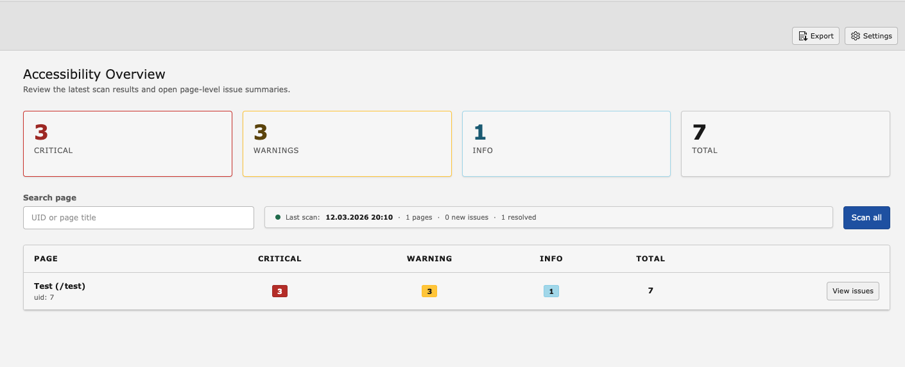
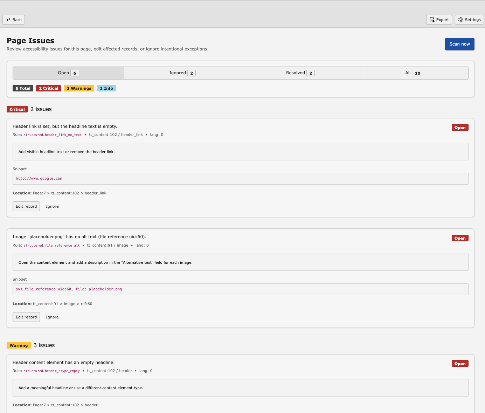
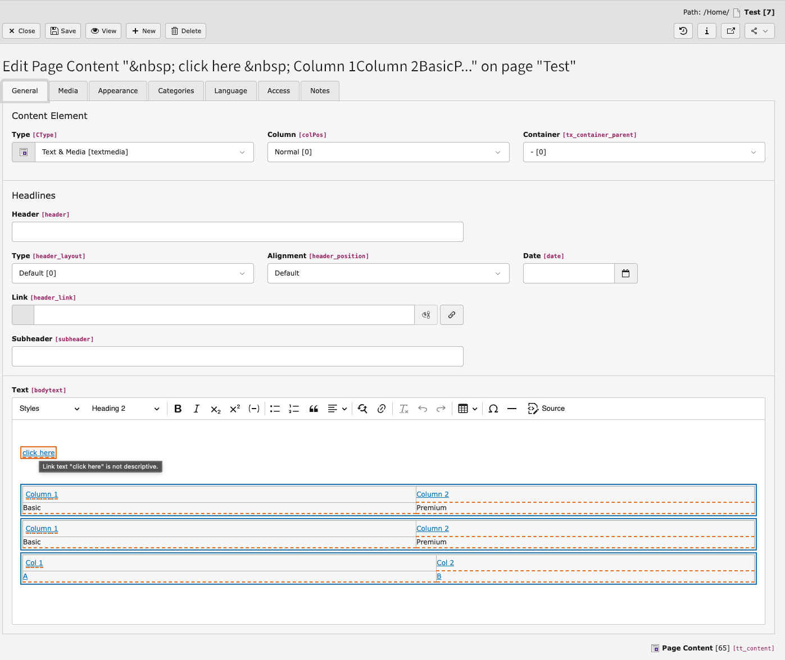

# TYPO3 Extension `a11y_quality_gate`


Accessibility Quality Gate brings accessibility checks directly into the TYPO3 editorial workflow.

It combines CKEditor inline feedback, backend issue management, manual and automated scans, and configurable quality gate rules to help editors and integrators catch common accessibility issues before content goes live.

More information, pricing, documentation, and portal access are available on the project website:

**https://typo3.priebera.sk/**

---

## Features

### Free

- CKEditor 5 inline highlighting for accessibility issues
- Backend overview and page detail modules
- Issue tracking with ignore / unignore workflow
- Stable issue fingerprints across rescans
- Manual scans via CLI
- Automated scans via TYPO3 Scheduler
- Changed-only scan mode for incremental rescans
- Quality gate warning mode on page publish / unhide
- CSV export
- TCA-based field discovery for `tt_content` RTE and file fields
- Settings module for enabling and disabling scanned fields
- Built-in WCAG 2.1 Level AA-oriented rules for common TYPO3 content problems

### Trial / PRO / Agency

- Remote frontend accessibility scans
- Remote page detail with issue breakdown and screenshot preview
- PDF export for overview and page detail reports
- Remote CSV export
- Per-site quality gate configuration
- Quality gate blocking mode on publish / unhide
- Diff tracking for new and resolved issues across scans
- Multi-site support for agencies

Plan details, trial access, and pricing:

- Trial: **https://typo3.priebera.sk/trial**
- Pricing: **https://typo3.priebera.sk/pricing**

---

## Requirements

- TYPO3 13.4 LTS
- PHP 8.2 or higher
- No additional services required for the Free version

---

## Screenshots

### Overview



### Page detail



### CKEditor inline highlighting



---

## Links

| | |
|---|---|
| **Website** | https://typo3.priebera.sk/ |
| **Documentation** | https://typo3.priebera.sk/docs |
| **Trial** | https://typo3.priebera.sk/trial |
| **Pricing** | https://typo3.priebera.sk/pricing |
| **Portal** | https://typo3.priebera.sk/portal |
| **Repository** | https://github.com/priebera1/typo3-a11y-quality-gate |
| **TER** | https://extensions.typo3.org/extension/a11y_quality_gate/ |

---

## Compatibility

| Version | TYPO3 | PHP | Support |
|---------|-------|-----|---------|
| 1.x | 13.4 | 8.2+ | Features and bugfixes |

---

## Built-in rules

### RTE rules

| Rule ID | Severity | WCAG |
|---------|----------|------|
| `rte.img_alt_missing` | Critical | 1.1.1 Non-text Content |
| `rte.img_alt_is_filename` | Warning | 1.1.1 Non-text Content / Best Practice |
| `rte.empty_heading` | Critical | 1.3.1 Info and Relationships |
| `rte.empty_link` | Critical | 2.4.4 / 4.1.2 |
| `rte.button_label_missing` | Critical | 4.1.2 Name, Role, Value |
| `rte.table_missing_header` | Warning | 1.3.1 Info and Relationships |
| `rte.table_th_missing_scope` | Warning | 1.3.1 (H63) |
| `rte.table_missing_caption` | Info | 1.3.1 (H39) / Best Practice |
| `rte.duplicate_id` | Warning | 1.3.1 Info and Relationships |
| `rte.svg_missing_title` | Warning | 1.1.1 Non-text Content |
| `rte.iframe_missing_title` | Critical | 4.1.2 Name, Role, Value |
| `rte.image_in_link_missing_alt` | Critical | 1.1.1 / 2.4.4 |
| `rte.marquee_or_blink` | Critical | 2.2.2 Pause, Stop, Hide |
| `rte.non_descriptive_link` | Warning | 2.4.4 Link Purpose / Best Practice |
| `rte.heading_hierarchy_jump` | Warning | 1.3.1 Info and Relationships / Best Practice |
| `rte.link_new_window_no_warning` | Warning | 3.2.2 On Input / Best Practice |

### Structured rules

| Rule ID | Severity | WCAG |
|---------|----------|------|
| `structured.file_reference_alt` | Critical | 1.1.1 Non-text Content |
| `structured.header_ctype_empty` | Warning | 1.3.1 Info and Relationships |
| `structured.header_link_no_text` | Critical | 2.4.4 / 4.1.2 |
| `structured.uploads_file_missing_description` | Warning | 2.4.4 Link Purpose |
| `structured.table_missing_caption` | Info | 1.3.1 (H39) / Best Practice |

`structured.file_reference_alt` checks image file references, falls back to
file metadata alt text if no reference-level alt text is set, and supports
decorative images via the file reference setting.

---

## Installation

```bash
composer require priebera/typo3-a11y-quality-gate
```

Then:

1. Install and activate the extension in the TYPO3 Extension Manager
2. Apply database schema updates
3. Flush caches
4. Open the Accessibility Quality Gate module in the backend
5. Run **Re-scan TCA** in Settings once
6. Configure a Scheduler task or run scans manually via CLI

For full setup and usage instructions, see the documentation:
**https://typo3.priebera.sk/docs**

---

## Configuration

### Field settings

In the Settings module you can:

- refresh supported fields from TCA
- enable or disable individual fields
- control which fields are included in future scans

Changes are applied only after clicking **Save settings**.

### Quality Gate

A default ruleset is created automatically on first use.

| Field | Description |
|---|---|
| `threshold_critical` | Maximum allowed open critical issues |
| `threshold_warning` | Maximum allowed open warnings (`-1` disables the warning threshold) |
| `publish_mode` | `0` = disabled, `1` = warn, `2` = block (PRO) |

For site-specific rulesets, set `site_identifier` to match the TYPO3 site
configuration identifier.

---

## CLI usage

```bash
# Scan a subtree
./vendor/bin/typo3 a11y:scan --root-pid=1

# Scan a single page
./vendor/bin/typo3 a11y:scan --page-uid=42

# Scan changed content only
./vendor/bin/typo3 a11y:scan --root-pid=1 --changed-only

# Scan a specific language
./vendor/bin/typo3 a11y:scan --root-pid=1 --language=1
```

---

## Backend User TSconfig

```typo3_typoscript
options.a11y_quality_gate {
    showToolbarItem = 1
    showScanAll = 1
    showScanNow = 1
}
```

| Option | Default | Description |
|---|---|---|
| `showToolbarItem` | `1` | Show accessibility indicator in the CKEditor toolbar |
| `showScanAll` | `1` | Show the "Scan all" button in the overview module |
| `showScanNow` | `1` | Show the "Scan now" button in page and record-related views |

---

## Scope

Accessibility Quality Gate is a TYPO3-native editorial quality layer. It helps
editors and integrators detect common accessibility issues in TYPO3 content
fields and manage them directly inside TYPO3.

It does not replace a full accessibility audit, rendered-page review, keyboard
testing, assistive technology testing, or a professional WCAG review.

Some rules reflect best practices and may not always correspond to a hard
WCAG 2.1 failure in every context. All findings should be reviewed in context.

---

## License

GPL-2.0-or-later