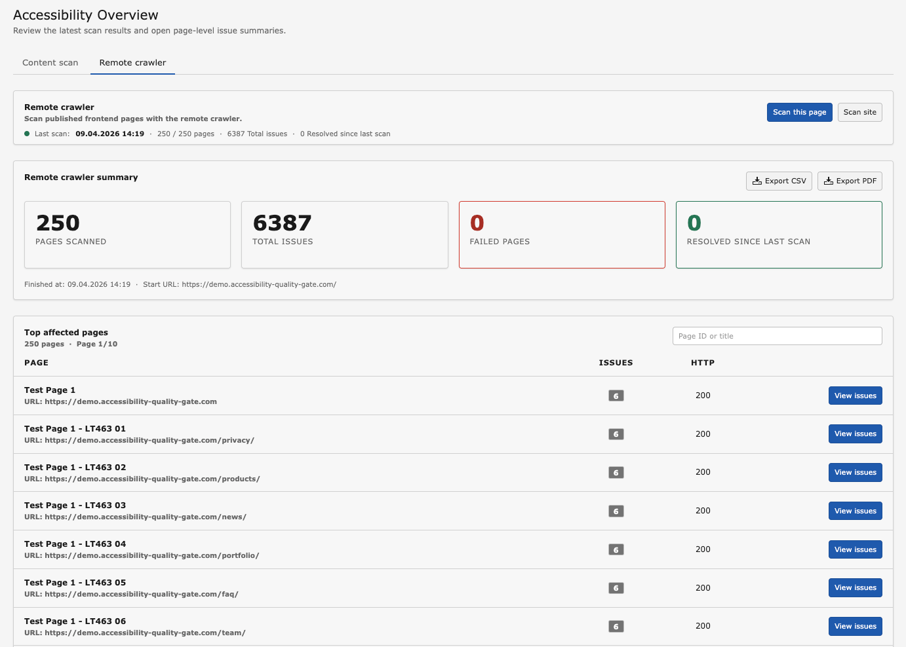
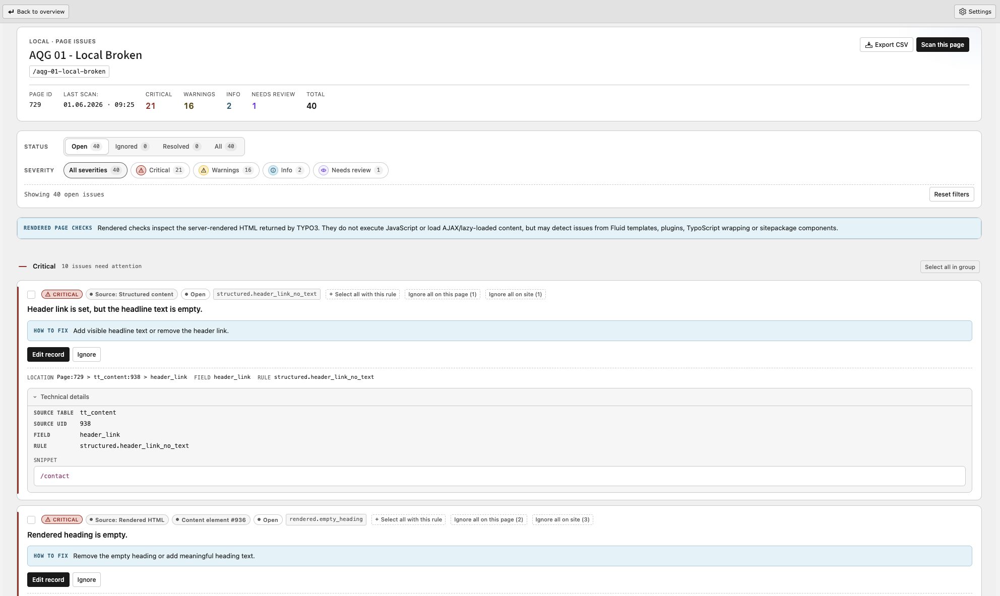
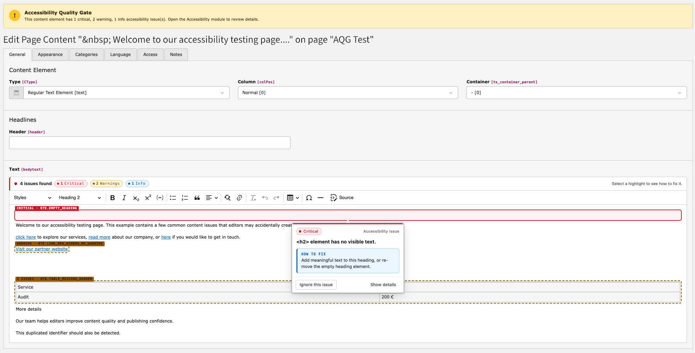

# Accessibility Quality Gate for TYPO3

[](https://packagist.org/packages/priebera/typo3-a11y-quality-gate)
[](https://packagist.org/packages/priebera/typo3-a11y-quality-gate)


Accessibility Quality Gate is a TYPO3-native accessibility checker that brings CKEditor feedback, WCAG issue management, rendered page checks and publishing safeguards into the editorial workflow.

[Product](https://typo3.priebera.sk/products/accessibility-quality-gate) ·
[Documentation](https://typo3.priebera.sk/docs) ·
[Pricing](https://typo3.priebera.sk/pricing) ·
[Free Trial](https://typo3.priebera.sk/trial) ·
[Support](https://typo3.priebera.sk/contact) ·
[Packagist](https://packagist.org/packages/priebera/typo3-a11y-quality-gate) ·
[TER](https://extensions.typo3.org/extension/a11y_quality_gate)

## Install

```bash
composer require priebera/typo3-a11y-quality-gate
./vendor/bin/typo3 extension:setup
```

Supports TYPO3 13.4 LTS and TYPO3 14.3+.

---

## Features

### Free — no licence key required

- CKEditor 5 inline highlighting for accessibility issues
- Backend overview and page detail modules
- Issue tracking with ignore / unignore workflow and expiry dates
- Stable issue fingerprints across rescans
- Batch ignore workflow with required reason confirmation
- Per-rule enable / disable in Settings
- Manual local scans via backend module and CLI
- Automated local scans via TYPO3 Scheduler
- Changed-only scan mode for incremental rescans
- Quality gate warning mode on page publish / unhide; editors can continue after reviewing the warning
- FREE rendered page checks for manual **Scan this page** and **Scan site** actions, inspecting TYPO3 server-rendered HTML without executing JavaScript
- CSV export
- TCA-based field discovery for `tt_content` RTE and file fields
- Settings module for enabling and disabling scanned fields
- Built-in rules that help identify common WCAG-related accessibility issues in RTE content, structured fields and rendered HTML

### Trial / PRO / Agency

- Remote browser accessibility scans via Playwright + axe-core
- Remote browser scan results with issue breakdown and screenshot preview
- Frontend scan history for site and single-page scans, including scan comparison and regression signals
- Recommended remediation plans with friendly rule metadata, affected user groups, WCAG references and suggested ownership
- Accessibility Statement Draft Assistant with English and German preview plus HTML, TXT and PDF exports
- WCAG 2.2 target-size reporting and expanded color-contrast remediation guidance
- PDF export for overview and page detail reports
- Remote CSV export
- Per-site quality gate configuration
- Quality gate blocking mode on publish / unhide
- Diff tracking for new and resolved issues across scans
- Multi-site support for agencies

Plan details, trial access and pricing:

- Trial: **https://typo3.priebera.sk/trial**
- Pricing: **https://typo3.priebera.sk/pricing**

---

## Requirements

- TYPO3 13.4 LTS or TYPO3 14.3+
- PHP 8.2 or higher
- No additional services required for the Free version

---

## Screenshots

### Overview



### Page detail



### CKEditor inline highlighting



---

## Links

| | |
|---|---|
| **Product** | https://typo3.priebera.sk/products/accessibility-quality-gate |
| **Documentation** | https://typo3.priebera.sk/docs |
| **Support** | https://typo3.priebera.sk/contact |
| **Trial** | https://typo3.priebera.sk/trial |
| **Pricing** | https://typo3.priebera.sk/pricing |
| **Portal** | https://typo3.priebera.sk/portal |
| **Repository** | https://github.com/priebera1/typo3-a11y-quality-gate |
| **Packagist** | https://packagist.org/packages/priebera/typo3-a11y-quality-gate |
| **TER** | https://extensions.typo3.org/extension/a11y_quality_gate/ |

---

## Compatibility

| Version | TYPO3 | PHP | Support |
|---------|-------|-----|---------|
| 1.4+ | 13.4 LTS / 14.3+ | 8.2+ | Features and bugfixes |
| 1.3.x | 13.4 LTS | 8.2+ | Security and bugfixes |

---

## Built-in rules

AQG includes rules across three categories. For the full reference with WCAG
mappings and fix guidance see the documentation:
**https://typo3.priebera.sk/docs/rules**

### RTE rules — CKEditor and RTE HTML content

| Rule ID | Severity | WCAG |
|---------|----------|------|
| `rte.img_alt_missing` | Critical | 1.1.1 |
| `rte.img_alt_is_filename` | Warning | 1.1.1 |
| `rte.img_alt_too_long` | Warning | 1.1.1 |
| `rte.img_alt_redundant_phrase` | Warning | 1.1.1 |
| `rte.empty_heading` | Critical | 1.3.1 |
| `rte.empty_link` | Critical | 2.4.4 / 4.1.2 |
| `rte.button_label_missing` | Critical | 4.1.2 |
| `rte.form_control_missing_label` | Critical | 1.3.1 / 3.3.2 |
| `rte.table_missing_header` | Warning | 1.3.1 |
| `rte.table_th_missing_scope` | Warning | 1.3.1 |
| `rte.table_missing_caption` | Info | 1.3.1 |
| `rte.duplicate_id` | Warning | 1.3.1 |
| `rte.svg_missing_title` | Warning | 1.1.1 |
| `rte.iframe_missing_title` | Critical | 4.1.2 |
| `rte.image_in_link_missing_alt` | Critical | 1.1.1 / 2.4.4 |
| `rte.marquee_or_blink` | Critical | 2.2.2 |
| `rte.non_descriptive_link` | Warning | 2.4.4 |
| `rte.heading_hierarchy_jump` | Warning | 1.3.1 |
| `rte.link_new_window_no_warning` | Warning | 3.2.2 |
| `rte.link_text_is_url_or_filename` | Warning | 2.4.4 |
| `rte.link_to_document` | Needs review | 2.4.4 |
| `rte.link_to_document_missing_notice` | Info | 2.4.4 |
| `rte.link_text_duplicate_different_targets` | Warning | 2.4.4 |

### Structured rules — TCA field values

| Rule ID | Severity | WCAG |
|---------|----------|------|
| `structured.file_reference_alt` | Critical | 1.1.1 |
| `structured.file_reference_alt_quality` | Warning | 1.1.1 |
| `structured.header_ctype_empty` | Warning | 1.3.1 |
| `structured.header_link_no_text` | Critical | 2.4.4 / 4.1.2 |
| `structured.header_level_is_h1` | Needs review | 1.3.1 |
| `structured.uploads_file_missing_description` | Warning | 2.4.4 |
| `structured.table_missing_caption` | Info | 1.3.1 |
| `structured.form_placeholder_as_label` | Warning | 1.3.1 / 3.3.2 |
| `structured.form_field_label_missing` | Critical | 1.3.1 / 3.3.2 |
| `structured.form_autocomplete_missing` | Warning | 1.3.5 |
| `structured.media_no_transcript_hint` | Needs review | 1.2.1 |

Some structured rules may adjust severity depending on the detected case, for example missing alternative text versus title-only fallback.

### Rendered HTML rules — FREE, manual, server-rendered HTML only

Rendered checks run when an editor manually starts **Scan this page** or **Scan site**. They inspect the final server-rendered HTML returned by TYPO3 and do not execute JavaScript, AJAX or lazy-loaded browser interactions. Manual **Scan site** applies these checks to supported frontend pages in the selected site scope. CLI and Scheduler scans continue to use the Local scan workflow. Browser-based crawling, JavaScript execution and screenshots remain Trial / PRO / Agency features.

| Rule ID | Severity | WCAG |
|---------|----------|------|
| `rendered.img_missing_alt` | Critical | 1.1.1 |
| `rendered.empty_link` | Critical | 2.4.4 |
| `rendered.empty_button` | Critical | 4.1.2 |
| `rendered.empty_heading` | Critical | 1.3.1 |
| `rendered.iframe_missing_title` | Critical | 4.1.2 |
| `rendered.form_control_missing_label` | Critical | 1.3.1 / 3.3.2 |
| `rendered.duplicate_id` | Warning | 1.3.1 |
| `rendered.table_missing_header` | Warning | 1.3.1 |
| `rendered.table_empty_header` | Warning | 1.3.1 |
| `rendered.svg_missing_accessible_name` | Warning | 1.1.1 |
| `rendered.html_lang_missing` | Critical | 3.1.1 |
| `rendered.page_title_missing` | Warning | 2.4.2 |
| `rendered.main_landmark_missing` | Needs review | 1.3.6 |
| `rendered.landmark_unique` | Needs review | 1.3.6 |

---

## Installation and setup

```bash
composer require priebera/typo3-a11y-quality-gate
```

Then run TYPO3 extension setup and flush caches:

```bash
./vendor/bin/typo3 extension:setup
./vendor/bin/typo3 cache:flush
```

Next:

1. Open the Accessibility Quality Gate module in the TYPO3 backend
2. Run **Re-scan TCA** in Settings once
3. Configure a Scheduler task or run scans manually via backend module or CLI

For full setup and usage instructions see the documentation:
**https://typo3.priebera.sk/docs**

---

## Configuration

### Field settings

In the Settings module you can:

- refresh supported fields from TCA
- enable or disable individual fields and rules
- control which fields are included in future scans

Changes are applied only after clicking **Save settings**.

### Quality Gate

A default ruleset is created automatically on first use.

| Field | Description |
|---|---|
| `threshold_critical` | Maximum allowed open critical issues |
| `threshold_warning` | Maximum allowed open warnings (`-1` disables the warning threshold) |
| `publish_mode` | `0` = disabled, `1` = warn, `2` = block (PRO) |

For site-specific rulesets set `site_identifier` to match the TYPO3 site
configuration identifier.

---

## CLI usage

```bash
# Scan a subtree
./vendor/bin/typo3 a11y:scan --root-pid=1

# Scan a single page
./vendor/bin/typo3 a11y:scan --page-uid=42

# Scan changed content only
./vendor/bin/typo3 a11y:scan --root-pid=1 --changed-only

# Scan a specific language
./vendor/bin/typo3 a11y:scan --root-pid=1 --language=1
```

CLI and Scheduler commands run the Local scan workflow. FREE rendered page checks are started manually from the backend through **Scan this page** or **Scan site**.

---

## Backend User TSconfig

```typo3_typoscript
options.a11y_quality_gate {
    showToolbarItem = 1
    showScanAll = 1
    showScanNow = 1
}
```

| Option | Default | Description |
|---|---|---|
| `showToolbarItem` | `1` | Show the AQG item in the TYPO3 backend toolbar |
| `showScanAll` | `1` | Show the "Scan site" button in the overview module |
| `showScanNow` | `1` | Show the "Scan this page" button in page and record-related views |

---

## Scope

AQG helps teams identify common accessibility issues early in the TYPO3 editorial workflow. It is not a legal certification tool and cannot guarantee WCAG, EAA, BITV or any other accessibility compliance on its own.

The Free rendered page check analyzes server-rendered HTML only. It does not execute JavaScript, wait for AJAX or lazy-loaded content, interact with cookie banners or take screenshots. Browser-based crawling, screenshots and axe-core checks are part of the Trial / PRO remote scanner.

Accessibility Quality Gate does not replace a full accessibility audit, keyboard testing, assistive technology testing or a professional WCAG review. Some rules reflect best practices and may not always correspond to a hard WCAG failure in every context. All findings should be reviewed in context.

---

## License

GPL-2.0-or-later
